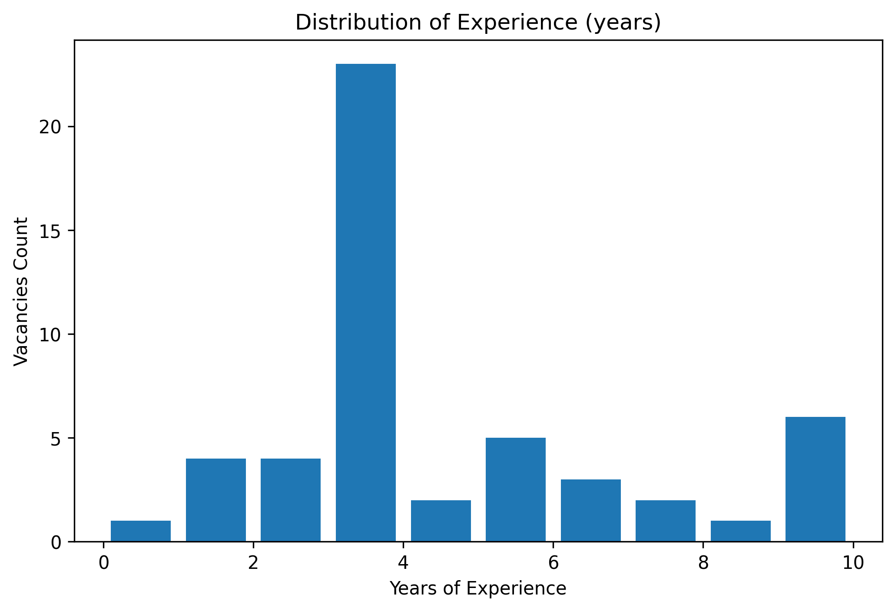
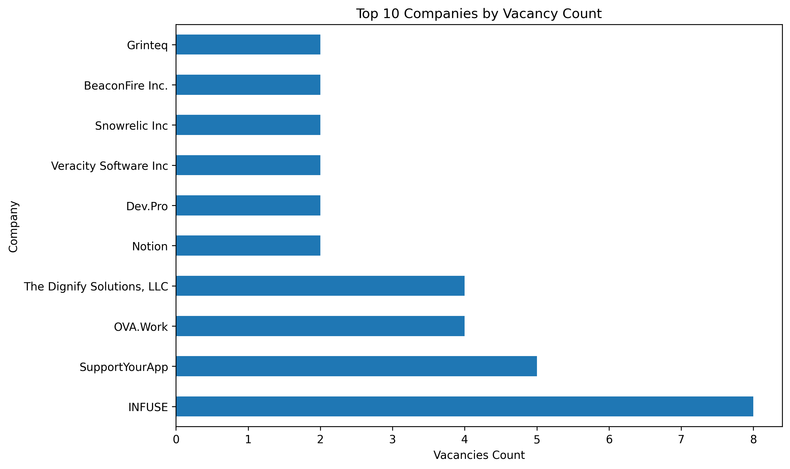
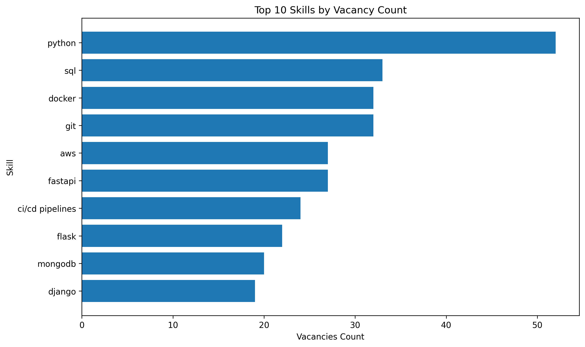

# 🕷️ Vacancy-Scraper

**Vacancy-Scraper** is a tool for automatic job data collection and analysis from LinkedIn website.  
The project uses **Scrapy**, **Selenium**, and **OpenAI API** to extract vacancy data, 
and **Pandas**, **MatPlotLib** and **NumPy** to transform and analyse the data.

---

## 🧠 Features
- Extracts skills and experience using OpenAI models.
- Handles dynamically loaded content.
- Saves results to CSV and performs automated analysis.
- Provides visual insights (graphs, skills, etc.).

---

## 📂 Project Structure

The project consists of two main modules:

- 🧭 [Scraper](#1--scraper)
- 📊 [Analyser](#2--analyzer)


### 📁 Example Project Structure

```
Vacancy-Scraper/
│
├── scraper/                # Data collection
│   ├── spiders/            # Scrapy spiders
│   ├── pipelines.py        # Data cleaning and processing
│   ├── items.py            # Job item definition
│   ├── settings.py         # Scrapy configuration
│   ├── .env                # Sensitive data
│   └── data_extractor.py   # Extracts skills & experience via OpenAI
│
├── analysis/               # Data analysis and visualization
│   ├── main.py
│   ├── analyze.py
│   ├── transform.py
│   └── settings.py         # Folder configuration
│
├── graphs/                 # Resulting graphs
├── raw_data/               # Raw .csv files
├── clean_data/             # Clean .csv files
├── config.cfg              # Configurating folder names
├── requirements.txt        # Required libraries
└── README.md  <---
```

---

## 💠 Modules

### 1. 🧭 Scraper
Module for collecting job data from various platforms.

**Technologies:**
- 🕷️ [Scrapy](https://scrapy.org/) - asynchronous web scraping framework.
- 🤖 [Selenium](https://www.selenium.dev/) - browser automation (used for detail pages).
- 🧠 [OpenAI API](https://platform.openai.com/docs/) - used to extract skills and experience from vacancy descriptions.

**Main tasks:**
- Collecting vacancy data (title, company, location, description, skills, link, etc.).
- Handling dynamic content.
- Saving results in CSV format.

### 2. 📊 Analyzer
Module for processing and visualizing collected data.

**Technologies:**
- 🐼 [Pandas](https://pandas.pydata.org/) - powerful data manipulation and analysis library.  
- 🔢 [NumPy](https://numpy.org/) - fundamental package for numerical computing in Python.  
- 📊 [Matplotlib](https://matplotlib.org/) - library for creating static, animated, and interactive visualizations.

**Main tasks:**
- Cleaning and normalizing data.
- Analyzing skills and experience.
- Generating visualizations and statistical graphs.

---

## 🚀 How to Run

### 1. Install the requirements:
```
pip install -r requirements.txt
```

### 2. ⚙️ Configure [`config.cfg`](config.cfg):

```cfg
[global]
raw_data_folder = raw_data

[analysis]
clean_data_folder = clean_data
graphs_folder = graphs
```

### 3. 🕷️ [Scraper](scraper/): 
    
- ⚙️ Configure [`.env`](scraper/env.sample):
```
EMAIL=example@example.com
PASSWORD=password
OPENAI_API_KEY=sk-proj-...
```

- 🚀 Run the scraper:

```
cd scraper/scraper

scrapy -a keywords="Your search words" -a location="location" vacancy
```
### 4. 🕷️ [Analyser](analysis/):

- 🚀 Run the analyser:

```
cd analysis/

python main.py
```
---

## 🧩 Future Plans
- Add a proxy to avoid 429 HTTP Error.
- Extend the list of supported vacancy websites.
 
--- 

## 📄 .csv example:

| Company | Position | Location | Experience | Skills | Vacancy Link |
|---------|---------|---------|------------|--------|--------------|
| INFUSE | AI Engineer (Remote, Contract) | Ukraine | 3+ years | ai, ml, python, flask, async, NLP, LLMs, pipelines| [Link](https://ua.linkedin.com/jobs/view/ai-engineer-remote-contract-at-infuse-4317321469?refId=ZC3ZzDpPyi41ebpgIkJohQ%3D%3D&trackingId=BpIHz2nCiSFsq5PxoajejA%3D%3D&position=1&pageNum=0) |
| INFUSE | AI Engineer (Remote, Contract) | Ukraine | 3+ years | python, ai/ml, backend development, FastAPI, pandas| [Link](https://ua.linkedin.com/jobs/view/ai-engineer-remote-contract-at-infuse-4317312662?refId=ZC3ZzDpPyi41ebpgIkJohQ%3D%3D&trackingId=k9PKsZ5MZvK5HL0VmYV3%2Bw%3D%3D&position=2&pageNum=0) |
| INFUSE | AI Engineer (Remote, Contract) | Ukraine | 3+ years | python, ai, ml, backend development, pipelines, MLOps, RPA | [Link](https://ua.linkedin.com/jobs/view/ai-engineer-remote-contract-at-infuse-4317307700?refId=ZC3ZzDpPyi41ebpgIkJohQ%3D%3D&trackingId=FXd0EK9%2BuQ9sXF5Y3qgElw%3D%3D&position=3&pageNum=0) |


## 📈 Graphs examples:

### Experience Distribution:

### Top Companies

### Top skills by vacancies

